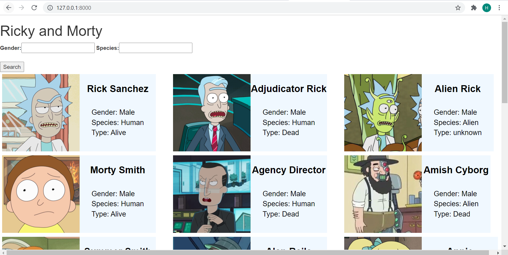
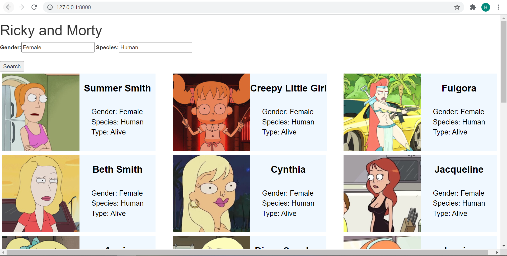

## Instructions to run the project

1. Open Anaconda prompt and navigate to the working folder

2. Create the conda env
   conda create -n "project_env"

3. Activate the env
   conda activate project_env

4. git clone to the project
   git clone https://github.com/RamPrathyushaGangisetty/Ricky_And_Morty.git

5. cd Ricky_And_Morty

6. Install the requirements
   pip install -r requirements.txt

7. Start the project
   python manage.py runserver

Access the web app at http://127.0.0.1:8000/
   
## Screenshots of the Web App

